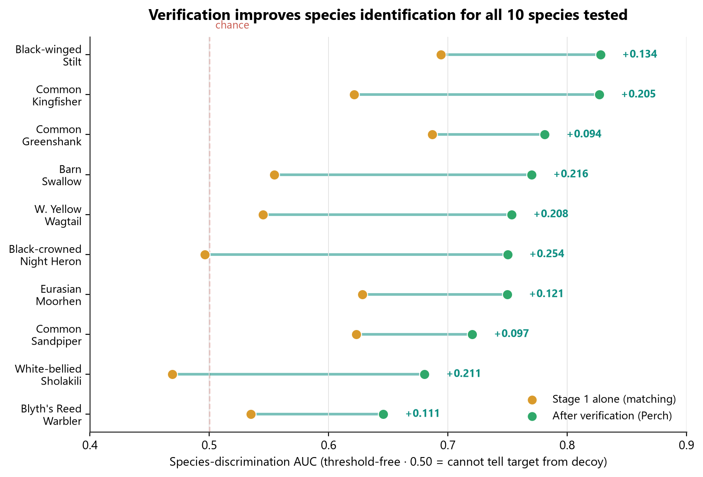
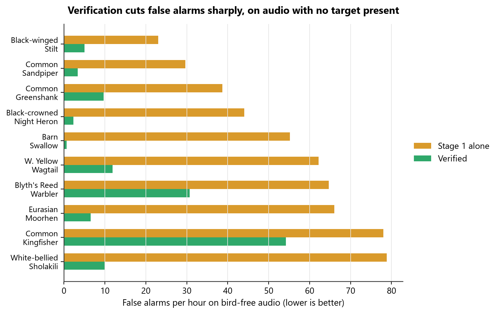
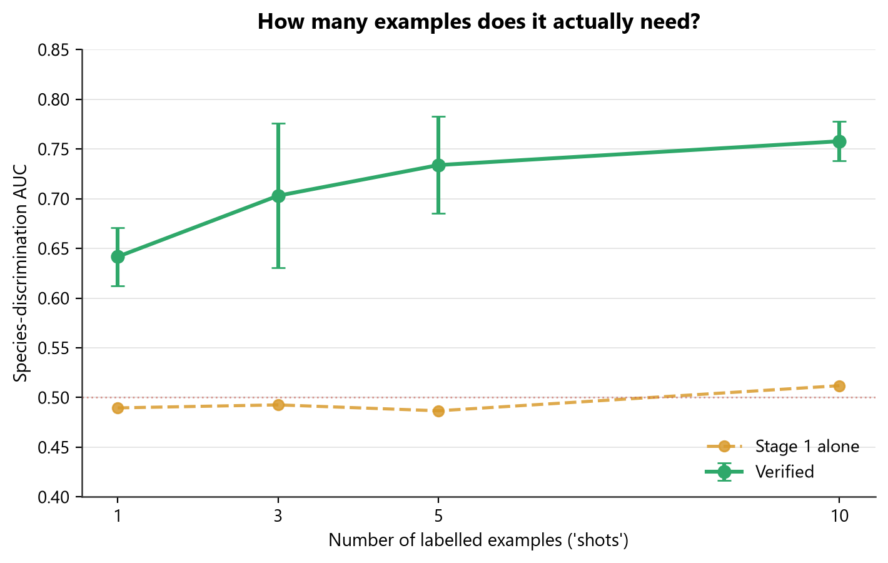

# ARGUS

**Few-shot bioacoustic detection for a threatened Western Ghats bird — learn a species from five examples, then find it in hours of unlabelled forest audio.**

**[Live demo →](#) <!-- TODO: add your Vercel URL here -->**

---

## Why this exists

The Western Ghats is one of the eight hottest biodiversity hotspots on Earth — and one of the least acoustically monitored. *Sholicola albiventris* (White-bellied Sholakili) — IUCN **Near Threatened** (2024 assessment), and High Conservation Concern under *State of India's Birds* — is the species this project is built around, and it has almost no labelled audio anywhere: 22 recordings in BirdCLEF 2024, nothing close to what a normal deep-learning pipeline expects to train on.

That's not a special case. Most of the species conservationists actually care about are rare *because* they're rare — which means the standard playbook (thousands of labelled examples per class) is unusable exactly where it matters most. ARGUS asks a narrower, more honest question instead: **can a model learn a new species from five example calls, and can it tell that species apart from others that sound almost the same?**

The answer turned out to be more interesting than a clean yes. A model that reliably notices "a bird called here" can still carry almost no information about *which* bird — and that gap is invisible to the metrics people normally report. Finding that gap, measuring it properly, and fixing it is what this project actually is.

## The finding

Every number below is read directly from the actual pipeline output, not illustrative — see [`ARGUS_TrackA_Lab_Notebook.md`](ARGUS_TrackA_Lab_Notebook.md) for the full dated engineering log and [`argus_multispecies_results.csv`](data/argus_multispecies_results.csv) for the raw data behind every chart.



| | Stage 1 alone (matching) | + Verification (Perch) |
|---|---|---|
| Mean species-discrimination AUC, 10 species | 0.587 | **0.749** |
| Species improved by verification | — | **10 / 10** |
| Confidence (Δ / SE) | — | **8.15** |
| False alarms / hour, best case | up to 90.8 | as low as **1.5** |
| Independent full replications | — | **3** (gains +0.165, +0.166, +0.161) |

0.50 AUC means the model cannot tell the target species from an acoustically similar decoy at all — a coin flip. Stage 1 alone lands there or close to it for several species; adding a Perch-embedding verification step lifts **every single one of the ten species tested**, by a margin larger than the measured run-to-run noise floor in every case. That last part matters more than it sounds — we measured the floor directly (the same configuration, run twice, scored 0.696 and 0.731 from GPU non-determinism alone) specifically so we wouldn't claim a result that was actually just noise.



On audio with **no known target present**, verification cuts false alarms from a mean of **54.0/hr to 13.4/hr — a 4× reduction** — the number that actually matters if a person is the one checking every alert. Two honest caveats we'd rather state than have found: these beds are real Western Ghats soundscapes, not silence, so any genuinely wild target call in them is being counted against us (every figure here is an upper bound); and our recall-matched control is unusable at this operating range — peak recall anywhere in the run is 0.778, so the 90%-recall threshold never binds and the two arms come back statistically indistinguishable at that operating point (237.9 vs 236.9/hr). The 4× reduction is measured at the best-F1 threshold, and that is the only false-alarm claim the data supports.



The project's whole premise is "five examples." We tested whether that's actually the right number rather than assuming it, three separate times. Going from 1 to 10 examples buys **+0.123** AUC on average — unambiguous, well clear of the measured noise floor. But no *individual* step is: the 1→3 jump came in at +0.067, +0.067 and +0.042 across the three runs, straddling the 0.043 floor rather than clearing it. An earlier version of this README said "one example is clearly not enough" — that was firmer than three runs support, and it has been softened rather than left standing.

**What we also found: four published techniques didn't transfer.** A DCASE-2023-winning augmentation, a DCASE-2024-winning front-end, hard-negative mining, and the prototypical-probe design from Google's own Perch 2.0 paper were each tested against the measured noise floor. All four made things worse in this five-shot, short-fine-tune regime — the untouched baseline beat every one of them. We kept that result rather than quietly dropping the experiments that didn't work.

**The sharpest version of the finding: the metric the field uses can't see it.** Scored the same detections, on the same recordings, three ways — average precision (what's normally reported) actually *falls* after verification (0.611 → 0.604, only 4/10 species improved), while species-discrimination AUC rises by a third of its range (0.585 → 0.751, 10/10 improved). Rank all six of our scoring rules by AP and the verified pipeline comes *last*; rank them by species AUC and it comes *first*. A team optimising the field's default metric would silently select the least species-specific model on offer. That gap between what AP sees and what actually happened is this project's real contribution — the pipeline is the instrument it was measured with.

## How it works

```
5 example recordings
        │
        ▼
┌────────────────────┐      ┌──────────────────────┐
│  Stage 1 — propose  │ ───▶ │  Stage 2 — verify     │ ───▶ confirmed detection
│  Custom CNN,        │      │  Google Perch v2      │
│  prototypical        │      │  embeddings + a       │
│  few-shot, fine-     │      │  trained classifier   │
│  tuned per clip      │      │                       │
└────────────────────┘      └──────────────────────┘
   fast, high recall,           slower, catches what
   weak on species ID           stage 1 gets wrong
```

- **Stage 1** is a small CNN trained from scratch on 40 non-target species (prototypical-network style), then fine-tuned in seconds on the five labelled examples for whatever species you're pointing it at. It's fast and rarely misses a candidate — but on its own it barely knows *which* bird it heard.
- **Stage 2** takes every candidate stage 1 flags, embeds it with Google's Perch v2, and scores it with a classifier trained on the same five examples. This is what recovers species identity.

Decoy species for testing are picked automatically by acoustic similarity in Perch's own embedding space — the four *hardest*, most confusable species, not an easy set chosen to flatter the result.

## Try it live

The demo (`site/index.html`) is a single-file, no-framework web app that connects to a live model running on Kaggle:

- Record straight from your microphone in the browser, or upload a clip
- Runs the real two-stage pipeline, not a canned response
- Every chart on the results pages — including the ones above — is real data from the runs in this repo, rendered interactively, not static images

To run your own backend: open [`ARGUS_Kaggle_Notebook.ipynb`](ARGUS_Kaggle_Notebook.ipynb) on Kaggle, attach the BirdCLEF 2024 competition data and a Perch v2 model, enable GPU + Internet, and run the cells in order. It exposes a public URL via Cloudflare Tunnel that the demo site connects to.

## Repository layout

```
arguswala_setup_v2.py     Cell 1 — data loading, decoy selection, verifier calibration
arguswala_v2.py           Cell 2 — two-stage detection across all target species
arguswala_sweeps.py       Cell 3 — shot-count and shot-selection-strategy experiments
arguswala_ladder.py       Cell 4 — ablation ladder (tests published techniques honestly)
ARGUS_Kaggle_Notebook.ipynb   The four cells above, packaged to import directly into Kaggle

site/index.html           Live demo — mic capture, results dashboard, all analysis charts
assets/                   Performance charts used in this README, generated from real run data

ARGUS_TrackA_Lab_Notebook.md   Full dated engineering log — every bug, every retraction, every real number
ARGUS_Literature_Review.md     ~20 papers reviewed and positioned against this project
ARGUS_Roadmap_Aug_Sept_2026.md What's automated, what's manual, what's next
ARGUS_Hardware_Deployment_Roadmap.md   Honest split: what's built vs. what's planned for field deployment

data/                              All raw CSV outputs, listed below
data/argus_multispecies_results.csv     Raw output of the full 10-species run
data/argus_species_covariates.csv       Per-species covariates (stereotypy, decoy similarity, etc.)
data/argus_sweep_shot_count.csv         Shot-count sweep raw output
data/argus_sweep_shot_strategy.csv      Shot-selection-strategy sweep raw output
data/argus_sweep_snr.csv                SNR-robustness sweep raw output
data/argus_sweep_decoy_difficulty.csv   Decoy-difficulty sweep raw output
data/argus_ablation_ladder.csv          Full ablation-ladder raw output (feature x verifier x hard-negatives)
```

Files prefixed `_` are working/scratch scripts, not part of the pipeline itself.

## Built with

Python · PyTorch (stage-1 encoder, trained from scratch) · TensorFlow / TensorFlow Hub (Perch v2) · scikit-learn · ONNX Runtime · librosa · FastAPI · vanilla JavaScript (hand-rolled SVG charts, Web Audio API — no charting library, no frontend framework) · Kaggle (GPU training/inference)

## Honesty, by design

This project keeps a public record of what didn't work alongside what did — including retracted claims, a discovered noise floor that overturned an earlier conclusion, and real bugs found and fixed with regression tests. See the "What did not work" section of the live demo, or `ARGUS_TrackA_Lab_Notebook.md` for the full account. We think that record is worth more than a version of this README that only shows the wins.

## Team

Subham Sai Samal · Vlkramzharis

<!-- TODO: add a LICENSE file and reference it here if you want this repo publicly licensed -->
